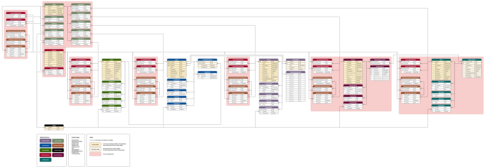

# Main Database

This repository contains initial tables, types and extensions for the main database used in production. It also contains sufficient dummy-data for use and testing within development environments.

This repository is kept up-to-date with changes to the production environment, to provided a safe setup to use for development and testing.

## Entity Relationship Diagram

Open [`erd.drawio`](./erd.drawio) with Draw.io to see the below image in a more manageable format.



> The diagram includes plans for extensions of the current setup beyond Events, Artists and Venues. Tables with a red background have not been implemented yet, though commented-out create table statements can be found for these tables within this repository.

## Running Locally

```sh
docker compose up -d --build
```

## How It Works

The `./statements` directory contains individual files to:

- Create the necessary extensions within the database,
- Create the custom types used,
- Create the tables, and
- Populate the tables with dummy data.

The `/create-table` and `/insert-into` group files into ordered directories to ensure that tables are created / populated in order. For instance, the `VenueStage` table relies upon the `Venue` table being created first, so we structure the folders to ensure that statements are executed in this order.

The [`init.sh`](./init.sh) script is called to execute each of these sql files in order.